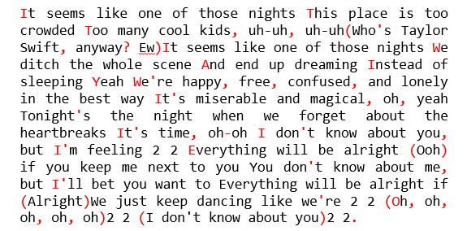
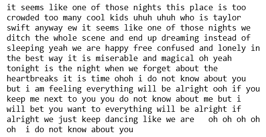

```{r , include = FALSE}
knitr::opts_chunk$set(collapse = T, comment = "#>")
```

This document introduces you to the **rlyrics** package and all the functions inside it. Here to explore the package we have used data fetched from [kaggle dataset](https://www.kaggle.com/geomack/spotifyclassification) as an example. Once you have installed the package read `vignette("Intro to rlyrics")` to learn more about it.

### Set up

*To get access to the Kaggle API, sign up for a Kaggle account at Kaggle. Then go to the 'Account' tab of your user profile (https://www.kaggle.com/<username\>/account) and select 'Create API Token'. This will trigger the download of kaggle.json, a file containing your API credentials. Place this file in the location **\~/.kaggle/kaggle.json**. The function will automatically read your Kaggle credentials from the above path.*

For more information about API call limits and API care recommendations please visit the [Kaggle API](https://github.com/Kaggle/kaggle-api).


# Overview

The goal of **rlyrics** is to extract and analyze lyrics. It provides functions to download songs attribute, extract lyrics, clean text and generate a word cloud. It makes all the steps seamless and fast.Using this package a user can analyse any (English) lyrics from any artist


The package is an assimilation of four independent functions:

1.  `download_data()`: The download data function downloads dataset from Kaggle, extracts the given columns from csv file and creates a dataframe.

2.  `extract_lyrics()`: The extract lyrics function, extracts the lyrics from API for a song title and artist and saves it as a dataframe with columns song title, artist and lyrics.

3.  `clean_text()`: The lyrics extracted from extract_lyrics() are not clean. It removes special characters, html tags, #tags, contraction words and converts everything to lower case.

4.  `plot_cloud()`: The plot cloud function creates a word cloud of most occurring words in a song/songs by an artist.

### Load the library

```{r setup, eval = FALSE, warning = FALSE}
library(rlyrics)
```

### 1. Downloading and Selecting

The first function in our library is the `rlyrics::download_data()`. This functions downloads the data and extracts the columns into a dataframe. 

```{r download-data }
dataset <- "geomack/spotifyclassification"
df <- rlyrics::download_data(dataset, c("song_title", "artist"))
head(df)
```

### 2. Extracting Lyrics

The second function in our library is the `rlyrics::extract_lyrics()`. This function gets the song_title and artist name, checks validity and availability of the combination, and extracts the lyrics for that song in a raw string format with header, footer etc which needs to be cleaned in order to create a human-readable text.

```{r extract-lyrics , eval = FALSE}
lyrics <- rlyrics::extract_lyrics( "22", "Taylor Swift")
```

```{r extract-lyrics-example, eval = FALSE, echo = FALSE, fig.width=7, fig.height=4}
lyrics
```

```{r, echo=FALSE, out.width="60%"}

```

### 3. Cleaning the text

As we see the raw lyrics need to be cleaned, that's where our third function `rlyrics::clean_text()` comes to play. This function turns the raw lyrics into a human-readable text, by removing all the HTML Tags, hash tags, contraction words, special characters. It also coverts everything to lower case

```{r clean_text, eval = FALSE, }
clean_text <- rlyrics::clean_text(lyrics)
```
```{r clean-text-example, eval = FALSE, echo = FALSE, fig.width=7, fig.height=4}
clean_text
```

```{r, echo=FALSE, out.width="60%"}

```

### 4. Creating WordCloud

In the last and final function we are using Word Cloud. WordCloud is an artistic rendering of the most frequent words in a text document. A higher occurrence for a word is translated into a larger text size. At this stage, we have helper functions to facilitate the extraction and cleaning of lyrics.

The `rlyrics::plot_cloud()` function accepts a dataframe with multiple artists and multiple song_title data. It will then extract the lyrics for all songs and saves a WordCloud of the most occurring terms in the file_path provided by the user. The WordCloud parameters to be set are self-explanatory: `max_font_size`, `max_word` and `background_color`.

```{r word-cloud, eval = FALSE, fig.show ='hold'}
song <-  data.frame(song_title  = c("22", "Bohemian Rhapsody"), 
                    artist = c("Taylor Swift", "Queen"))

# plotting and saving WordCloud
word_cloud <- rlyrics::plot_cloud(song, max_font_size=1.6, max_words=100, background_color="white")
```

```{r word-cloud-example,eval = FALSE, echo = FALSE, fig.width=7, fig.height=4}
word_cloud
```

```{r ,echo=FALSE, out.width="60%"}
knitr::include_graphics("../man/figures/wordcloud.png")
```

